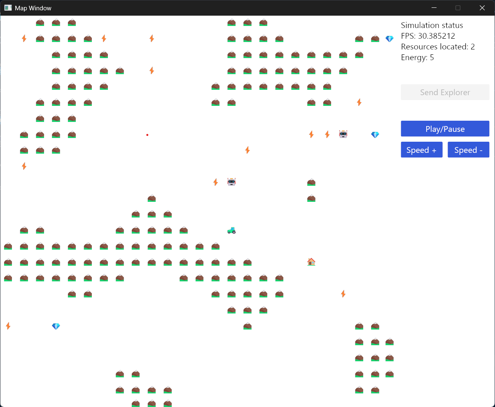

# 👨🏼‍🤝‍👨🏼 Participants
  - MANFO JIENGAP Rosvalde Florient
  - FOUMBI DJOMO Ranyl Josué
  - Robin MALPART

# 🏗️ Description du projet

  Ce projet est une mise en pratique des connaissances acquises au cours du module d'enseignement Rust et WebAssembly.

  Il s'agit d'une simulation d'interactions entre robots évoluant chacun sur des threads distincts pour soit localiser des ressources ou récolter les ressources localisées à partir de leurs coordonnées.

  ##  📂 Structure du projet

     src/
    ├── main.rs — *Point d'entrée du programme*
    ├── environment/ — *Tous les éléments utilisés pour construire la carte*
    │   ├── map.rs
    │   ├── mod.rs
    │   └── tile.rs
    ├── robots/ — *Contient les différents robots et les fonctions qui leurs sont propres*
    │   ├── explorer.rs
    │   ├── harvester.rs
    │   ├── mod.rs
    │   └── robot.rs
    ├── simulation/ — *Contient la logique de création des threads pour chaque robot et la gestion de l'évolution de la simulation*
    │   ├── mod.rs
    │   └── simulation.rs
    └── windows/ — *Contient les fonctions de création des composants de l'interface graphique*
        ├── graphic_ui.rs
        ├── map_grid.rs
        ├── mod.rs
        └── utils.rs

  ## 🚀 Consignes d'exécution

  Pour exécuter le projet, il suffit d'utiliser la commande *`cargo run`*.
  Une fois la fenêtre ouverte, il faut cliquer sur start pour démarrer la simulation et cliquer sur le bouton *`Send Explorer`* pour envoyer un robot explorer.

  L'explorer va parcourir la carte et lorsqu'il aura trouvé une ressource, il retournera à la base et un robot *`Harvester`* sera envoyé pour la collecter. 

  
